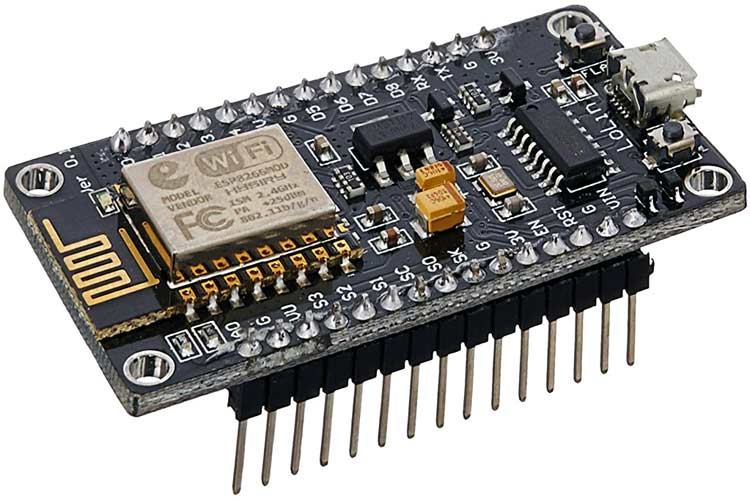
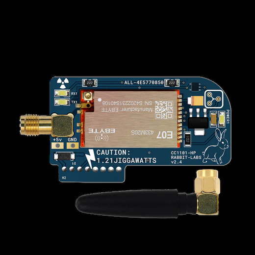
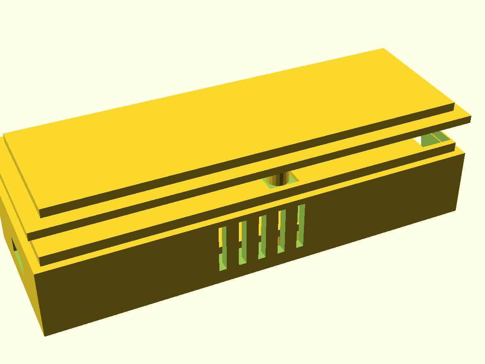
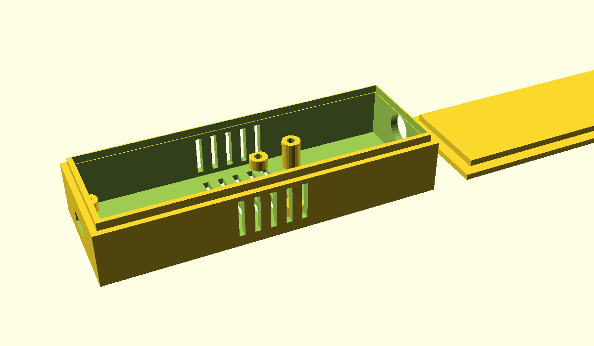

# Radio Controller

A **433MHz RF light controller** built with an **ESP8266** (NodeMCU v2) and **CC1101** transceiver, managed through **ESPHome** and integrated with **Home Assistant**. Controls bedroom and living room lights over **ASK/OOK** modulation using captured RC Switch codes, with **Amazon Alexa** voice control via emulated_hue. Also functions as a passive **RF signal monitor**, logging all received 433MHz transmissions for discovering nearby weather stations, door sensors, and other devices. Includes a parametric **3D printable case** designed in **OpenSCAD**.


## Hardware

| NodeMCU v2 (ESP8266) | CC1101 RF Transceiver (433MHz) |
|:---:|:---:|
|  |  |

| Component | Details |
|-----------|---------|
| MCU | NodeMCU ESP8266 v2 (nodemcuv2) |
| RF Transceiver | CC1101 with SMA antenna |
| Protocol | 433.92 MHz ASK/OOK |
| Integration | Home Assistant via ESPHome native API |
| Voice control | Amazon Alexa via emulated_hue |

## Wiring (SPI)

| CC1101 Pin | NodeMCU Pin | Function |
|------------|-------------|----------|
| SCK | D5 (GPIO14) | SPI Clock |
| MISO | D6 (GPIO12) | SPI Data Out |
| MOSI | D7 (GPIO13) | SPI Data In |
| CSN | D8 (GPIO15) | Chip Select |
| GDO0 | D2 (GPIO4) | RX + TX (shared) |
| GDO2 | D1 (GPIO5) | Connected, unused |
| VCC | 3.3V | Power (NOT 5V!) |
| GND | GND | Ground |

> **Note:** GDO0 is shared for both receiving and transmitting via `allow_other_uses: true`. The CC1101 native component switches between RX/TX modes automatically using `cc1101.begin_tx` / `cc1101.begin_rx` triggers.

## Features

- **Bedroom lights** (protocol 1) — Toggle, ON, OFF via HA buttons and Alexa voice commands
- **Living room lights** (protocol 3) — 8 buttons: toggle, on, off, timers (30s/30min/60min)
- **RF monitoring** — Counts received signals, logs all codes for device discovery
- **Noise filtering** — Protocol 2 code=0x0 spurious signals filtered out in lambda
- **WiFi hardening** — `fast_connect`, `power_save_mode: none`, max TX power for stable connection
- **3D printable case** — Parametric OpenSCAD enclosure with SMA antenna pass-through

## Architecture

```
┌──────────┐     SPI      ┌────────┐    433MHz    ┌──────────────┐
│ NodeMCU  │◄────────────►│ CC1101 │◄────────────►│ RF Lights    │
│ ESP8266  │              │  TX/RX │              │ (bedroom,    │
└────┬─────┘              └────────┘              │  living room)│
     │ WiFi                                       └──────────────┘
     ▼
┌──────────┐  emulated_hue  ┌───────┐
│  Home    │◄──────────────►│ Alexa │
│Assistant │                └───────┘
└──────────┘
```

## Setup

### 1. Prerequisites

- [ESPHome](https://esphome.io/) 2025.12.0+ (native CC1101 support)
- Home Assistant with ESPHome addon
- NodeMCU with ESPHome already flashed

### 2. Configure secrets

Copy and edit the secrets file:
```bash
cp secrets.yaml.example secrets.yaml
# Edit with your actual WiFi password, API key, etc.
```

### 3. Deploy

Upload config to HA and flash via ESPHome dashboard:
```bash
scp radio-controller.yaml ha:/homeassistant/esphome/radio-controller.yaml
```
Then open ESPHome dashboard in HA and click Install → Wirelessly.

### 4. Sniff RF codes

Open ESPHome logs and press buttons on your RF remotes. Look for entries like:
```
[rf_monitor] RC Switch: protocol=1 code=0x353FC0
```

### 5. Alexa integration

Bedroom lights are exposed via `emulated_hue` through `input_boolean.bedroom_light` in HA with automations that trigger the ESPHome button presses.

## RF Signal Discovery

The device logs all received 433MHz signals for identifying nearby devices (weather stations, door sensors, etc.):
- **Counter sensor** — "RF Signals Received" tracks daily activity (resets at midnight)
- **Last code sensor** — "Last RF Code" shows the most recent protocol + code
- Repeating codes every 30-60s are likely weather stations
- Codes appearing on events (door open/close) are likely contact sensors

## 3D Printed Case

Parametric OpenSCAD enclosure in `case/radio-controller-case.scad`. Fits NodeMCU v2 + CC1101 with SMA antenna.

| Assembled preview | Print layout (bottom + lid) |
|:---:|:---:|
|  |  |

- Mounting posts for both boards (M2 screws)
- Micro-USB cutout for power/programming
- SMA antenna hole for external antenna
- Snap-fit lid with alignment lip
- Ventilation slots on bottom, top, and sides
- No supports needed — print bottom and lid flat

Open in [OpenSCAD](https://openscad.org/), set `mode = "preview"` to see assembled view or `"print"` for print layout. Adjust `tol` parameter for your printer.

## Project Structure

```
radio-controller/
├── radio-controller.yaml          # ESPHome configuration
├── secrets.yaml                   # WiFi/API credentials (git-ignored)
├── case/
│   └── radio-controller-case.scad # 3D printable enclosure (OpenSCAD)
├── HOWTO.md                       # Development notes
└── README.md
```

## Known Issues

- **Living room lights** (protocol 3) — TX codes captured but lights don't respond; original remote also broken, likely receiver pairing issue
- **Protocol 2 noise** — RF interference generates ~2-3 spurious protocol 2 code=0x0 signals per minute; filtered in lambda
- **WiFi signal** — Marginal at -65 to -74 dBm; mitigated with `power_save_mode: none` and max TX power
